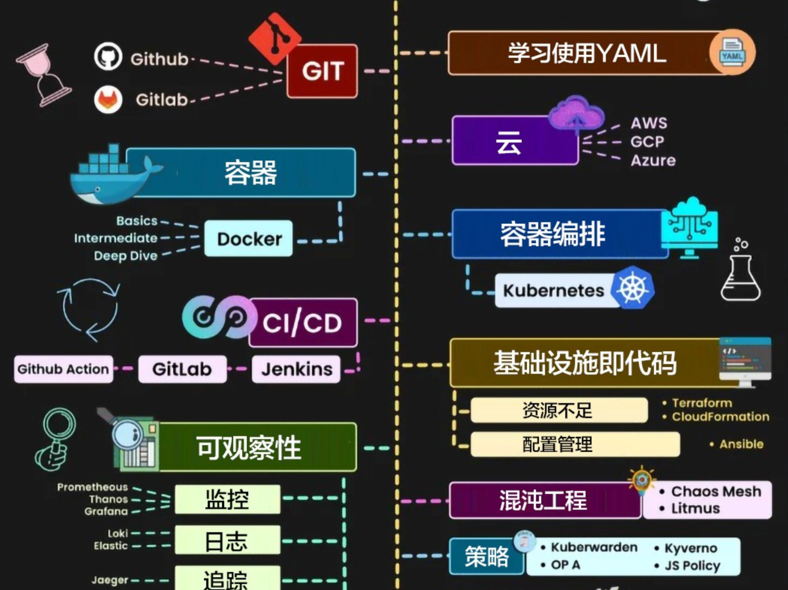
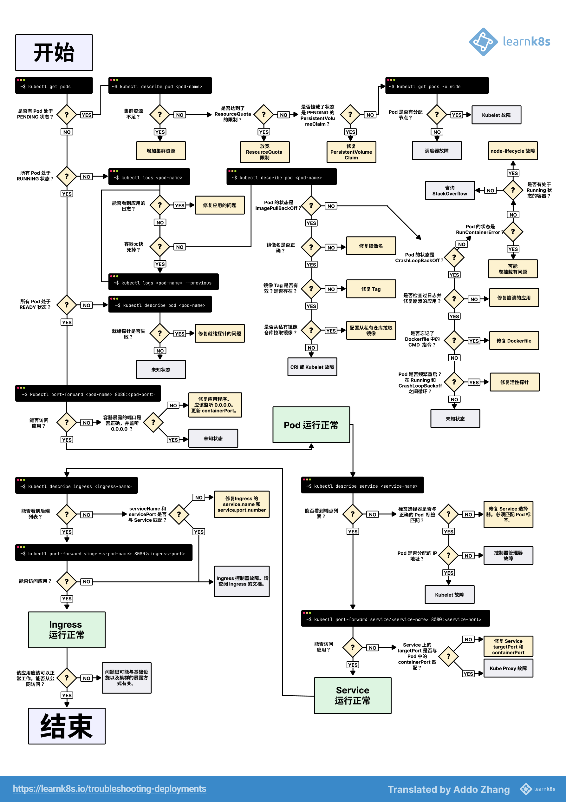

[🏠 首页](../_index.md) / [Kubernetes](_index.md) / 云原生 DevOps 应知应会

# 云原生 DevOps 应知应会

## 1. 容器基础  

### 1.1 容器概述  

- [容器 vs 虚拟机](https://www.atlassian.com/zh/microservices/cloud-computing/containers-vs-vms)
- 容器的核心优势：[何为容器化？它带来什么好处？](https://www.veritas.com/zh/cn/information-center/containerization)  

### 1.2 容器运行时  

- Docker：[Docker 快速入门](https://docker.easydoc.net/doc/81170005/cCewZWoN/lTKfePfP)
- containerd / CRI-O  

在线体验 Docker：[Play with Docker](https://labs.play-with-docker.com/)  

### 1.3 容器网络  

- Bridge, Host, None, Macvlan
- CNI 插件：
  - [Flannel](https://github.com/flannel-io/flannel)
  - [Calico](https://github.com/projectcalico/calico)
  - Cilium  

### 1.4 容器存储  

- Volume、Bind Mount、OverlayFS  
- 存储方案：
  - [Longhorn](https://longhorn.io/)
  - [Ceph](https://ceph.io/)

---

## 2. Kubernetes 运行基础

Kubernetes 架构：

### 2.1 核心组件  

- API Server
- Scheduler
- Controller Manager
- Kubelet
- Kube-Proxy  

参考博客：[kubernetes 核心组件运行机制-原理解析](https://juejin.cn/post/7357261180493348890)

### 2.2 资源管理  

- Pod、Deployment、StatefulSet、DaemonSet  
- Job / CronJob、ConfigMap、Secret  

### 2.3 存储管理  

- PersistentVolume（PV） & PersistentVolumeClaim（PVC）  
- StorageClass & CSI（容器存储接口）  

### 2.4 网络管理  

- Service（ClusterIP, NodePort, LoadBalancer, Headless）  
- Ingress & Ingress Controller（Nginx, Traefik, Istio）

---

## 3. Kubernetes 运维管理  

### 3.1 集群安装与配置  

- Kubeadm：快速部署 Kubernetes 集群
- MiniKube：本地单节点 Kubernetes
- Kind：在 Docker 容器中运行 Kubernetes
- K3s：轻量级 Kubernetes 集群
- Rancher：企业级 Kubernetes 管理平台

在线体验 Kubernetes：

- [Play with Kubernetes](https://labs.play-with-k8s.com/)
- [killercoda](https://killercoda.com/kubernetes)

### 3.2 监控与日志  

- Prometheus + Grafana（监控）：[prometheus+grafana监控系统教程](https://jerrydevs.com/post/35)
- ELK
- Loki（日志收集）：[Loki 日志收集系统](https://docs.youdianzhishi.com/k8s/logging/loki/overview/)
- Jaeger
- OpenTelemetry（链路追踪）  [OpenTelemetry 实战：从零实现分布式链路追踪](https://crossoverjie.top/2024/08/20/ob/OpenTelemetry-01-trace/)

### 3.3 资源调优  

- CPU / 内存 限制（Requests & Limits）  
- HPA 自动扩展  
- 调度优化（亲和性 / 反亲和性 / Taints & Tolerations）  

---

## 4. Kubernetes 高级运维  

### 4.1 Kubernetes 安全  

- RBAC 权限管理  
- Pod 安全策略（PSP / SecurityContext）  
- NetworkPolicy 网络隔离  
- Istio / Linkerd（Service Mesh）  

### 4.2 备份与恢复  

- [etcd 备份与恢复](https://www.zhaowenyu.com/etcd-doc/ops/data-backup-restore.html)  
- [Velero（集群数据备份）](https://velero.io/docs/v1.15/)  
- ArgoCD
- [GitLab CI 实践](https://juejin.cn/post/7428032840288305192)
- [GitOps 实践](https://chinalhr.github.io/post/gitops-argo-cd/)  

### 4.3 故障排查  

- kubectl describe / logs / exec  
- 网络排查（Service / Ingress / CNI）  
- 存储排查（PV / PVC / CSI）  

Kubernetes 故障排查图谱：

---

## 5. 进阶工具与实践  

### 5.1 Kubernetes CI/CD  

- GitOps（ArgoCD / FluxCD）  
- Jenkins / Tekton / GitLab CI  

### 5.2 资源管理工具  

- Helm（应用打包与部署） ：[Helm 快速入门指南](https://helm.sh/zh/docs/intro/quickstart/)
- Kustomize（YAML 资源管理）  

### 5.3 混沌工程  

- [Chaos Mesh](https://chaos-mesh.org/website-zh/docs/next/)  
- LitmusChaos  

---

## 6. 常用工具推荐  

| 工具 | 用途 | 官网 |
|----------|----------|----------|
| Kubectl | Kubernetes CLI | <https://kubernetes.io/docs/reference/kubectl/> |
| K9s | Kubernetes 终端管理工具 | <https://k9scli.io/> |
| Lens | Kubernetes 可视化管理 | <https://k8slens.dev/> |
| Prometheus | 监控 | <https://prometheus.io/> |
| Grafana | 可视化 | <https://grafana.com/> |
| Fluent Bit | 日志收集 | <https://fluentbit.io/> |
| Helm | Kubernetes 包管理 | <https://helm.sh/> |
| ArgoCD | GitOps 持续交付 | <https://argo-cd.readthedocs.io/> |
| Istio | Service Mesh | <https://istio.io/> |
| Chaos Mesh | 混沌工程 | <https://chaos-mesh.org/> |
| Kustomize | Kubernetes 资源管理 | <https://kustomize.io/> |

---

## 7. Kubernetes 运维最佳实践  

### 7.1 资源优化

- 合理设置 Requests & Limits  
- 使用 HPA/VPA 进行自动扩展  
- 合理选择 Pod 亲和性和调度策略  

### 7.2 安全管理

- 最小权限 RBAC 配置  
- 启用 NetworkPolicy 进行网络隔离  
- 避免使用 root 用户运行容器  

### 7.3 日志与监控

- EFK/Loki 进行日志采集  
- Prometheus + Grafana 进行监控  
- OpenTelemetry 进行链路追踪  

### 7.4 备份与恢复

- 定期备份 etcd  
- 使用 Velero 备份 PVC 数据  
- 确保 CI/CD 变更可回滚  

### 7.5 高可用

- 多 Master 节点 + Keepalived + HAProxy  
- 使用 StatefulSet 管理有状态应用  
- 存储选型（Ceph, NFS, Longhorn）  

---

## 8. 推荐学习网站  

| 网站           | 内容          | 链接                            |
| ---------------- | --------------- | --------------------------------- |
| Kubernetes 官方文档  | Kubernetes 官方教程 | <https://kubernetes.io/docs>      |
| Learn Kubernetes | 深入 Kubernetes   | <https://learnk8s.io/>            |
| Prometheus 文档    | 监控系统教程          | <https://prometheus.io/docs/>     |
| Istio 官方文档       | Service Mesh 教程 | <https://istio.io/latest/docs/>   |
| ArgoCD 官方文档      | GitOps 持续交付     | <https://argo-cd.readthedocs.io/> |

---

## 总结

文档涵盖了 Kubernetes 运维的方方面面，包括基础知识、运维管理、高级运维、最佳实践和工具推荐。你可以根据需求重点学习某些章节，并结合实践操作。  

---
[« 二进制搭建 K8s - 4 部署 Node](binary-build-k8s-04-deploy-worker.md)

[» Kubernetes 0-1 尝试理解云原生](cloud-native-understood.md)
